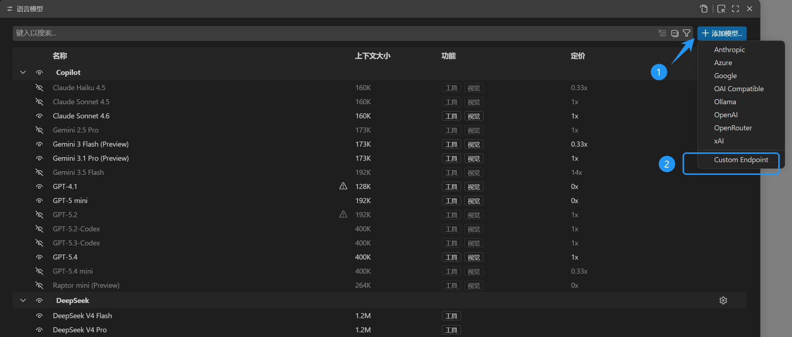

# [VSCode BYOK](https://code.visualstudio.com/docs/copilot/customization/language-models#_bring-your-own-language-model-key)

[Bring Your Own Language Model API Key (BYOK)](https://code.visualstudio.com/docs/copilot/customization/language-models#_bring-your-own-language-model-key) is a new feature in VSCode that allows users to use third-party language model provider API keys within GitHub Copilot. With BYOK, you can integrate your preferred language models into Copilot for more personalized and customized code suggestions.

## ✨ Highlights

- Support for multiple custom model providers, such as DeepSeek
- Configure multiple models and switch between them seamlessly in Copilot
- Provides the same user experience and interface as official GitHub Copilot models within VSCode
- No additional extensions required — configure directly in Copilot settings

## ⚡ How to Use

1. Prepare a third-party language model provider's API key (e.g., DeepSeek)
2. Press `Ctrl + Shift + P` to open the Command Palette, type `Chat: Manage Language Models` and select it
    
3. Choose to add a model, enter the provider name (e.g., DeepSeek), API key, and select `chat-completions` mode
4. In the `chatLanguageModels.json` file that appears, add the following configuration:

   ```json
   {
      "name": "DeepSeek",
      "vendor": "customendpoint",
      "apiKey": "<The stored name of the API KEY you just entered; it varies each time>",
      "apiType": "chat-completions",
      "models": [
         {
             "id": "deepseek-v4-flash",
             "name": "DeepSeek V4 Flash",
             "url": "https://api.deepseek.com",
             "supportsReasoningEffort": [
                 "high",
                 "max"
             ],
             "toolCalling": true,
             "vision": false,
             "thinking": true,
             "maxInputTokens": 800000,
             "maxOutputTokens": 393216
         },
         {
             "id": "deepseek-v4-pro",
             "name": "DeepSeek V4 Pro",
             "url": "https://api.deepseek.com",
             "supportsReasoningEffort": [
                 "high",
                 "max"
             ],
             "toolCalling": true,
             "vision": false,
             "thinking": true,
             "maxInputTokens": 800000,
             "maxOutputTokens": 393216
         }
      ],
      "settings": {
         "deepseek-v4-pro": {
             "reasoningEffort": "max"
         },
         "deepseek-v4-flash": {
             "reasoningEffort": "max"
         }
      }
   }
   ```

5. After saving the file, reopen the Copilot Chat interface and you will see the newly added DeepSeek models in the model selector
6. The `chatLanguageModels.json` file can also be opened via `Chat: Open Language Models (JSON)` in VSCode settings
